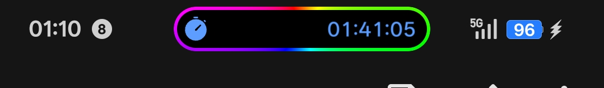

## English

### What is this

Some RGB lights which spins around the live alert capsule. Nothing special

### What you need

- An unmodified `SystemUIPlugin.apk` (works on everything except Android 17+)
- Any APK decompiler — MT Manager, NP Manager, whatever you have
- This class:
  ```
  com/oplus/systemui/plugins/seedling/capsule/ui/view/CapsuleView.smali
  ```
- DSV or Core patch / Core crack

Once you have all that, you're good to go.

### How to apply?

#### Step 1 - Add the fields
Somewhere near the top of the class where the other fields are, add these:
```smali
.field public mRgbAngle:F

.field public mRgbLastCx:F

.field public mRgbLastCy:F

.field public mRgbMatrix:Landroid/graphics/Matrix;

.field public mRgbPaint:Landroid/graphics/Paint;

.field public mRgbRect:Landroid/graphics/RectF;

.field public mRgbShader:Landroid/graphics/SweepGradient;
```

#### Step 2 - Add the methods
Paste both methods at the very end of the class.
(I think onDrawEffect contents can be inserted inside existing onDraw method, but for simplicity and debugging purposes I separate them)

```smali
.method public onDrawEffect(Landroid/graphics/Canvas;)V
    .registers 3

    invoke-super {p0, p1}, Landroid/view/View;->onDrawEffect(Landroid/graphics/Canvas;)V

    invoke-direct {p0, p1}, Lcom/oplus/systemui/plugins/seedling/capsule/ui/view/CapsuleView;->showRgbEffect(Landroid/graphics/Canvas;)V

    invoke-virtual {p0}, Landroid/view/View;->postInvalidateOnAnimation()V

    return-void
.end method
```

```smali
.method private final showRgbEffect(Landroid/graphics/Canvas;)V
    .registers 16

    iget-object v0, p0, Lcom/oplus/systemui/plugins/seedling/capsule/ui/view/CapsuleView;->q:Landroid/graphics/drawable/GradientDrawable;

    if-nez v0, :cond_5

    return-void

    :cond_5
    invoke-virtual {v0}, Landroid/graphics/drawable/Drawable;->getBounds()Landroid/graphics/Rect;

    move-result-object v1

    iget v2, v1, Landroid/graphics/Rect;->left:I

    iget v3, v1, Landroid/graphics/Rect;->top:I

    iget v4, v1, Landroid/graphics/Rect;->right:I

    iget v5, v1, Landroid/graphics/Rect;->bottom:I

    sub-int v1, v4, v2

    if-lez v1, :cond_da

    add-int v1, v2, v4

    int-to-float v6, v1

    const v1, 0x40000000

    div-float/2addr v6, v1

    add-int v1, v3, v5

    int-to-float v7, v1

    const v1, 0x40000000

    div-float/2addr v7, v1

    iget-object v0, p0, Lcom/oplus/systemui/plugins/seedling/capsule/ui/view/CapsuleView;->mRgbPaint:Landroid/graphics/Paint;

    if-nez v0, :cond_45

    new-instance v0, Landroid/graphics/Paint;

    const/4 v1, 0x1

    invoke-direct {v0, v1}, Landroid/graphics/Paint;-><init>(I)V

    sget-object v1, Landroid/graphics/Paint$Style;->STROKE:Landroid/graphics/Paint$Style;

    invoke-virtual {v0, v1}, Landroid/graphics/Paint;->setStyle(Landroid/graphics/Paint$Style;)V

    invoke-virtual {p0}, Landroid/view/View;->getResources()Landroid/content/res/Resources;

    move-result-object v1

    invoke-virtual {v1}, Landroid/content/res/Resources;->getDisplayMetrics()Landroid/util/DisplayMetrics;

    move-result-object v1

    iget v1, v1, Landroid/util/DisplayMetrics;->density:F

    const v10, 0x40000000

    mul-float/2addr v10, v1

    invoke-virtual {v0, v10}, Landroid/graphics/Paint;->setStrokeWidth(F)V

    iput-object v0, p0, Lcom/oplus/systemui/plugins/seedling/capsule/ui/view/CapsuleView;->mRgbPaint:Landroid/graphics/Paint;

    :cond_45
    iget-object v8, p0, Lcom/oplus/systemui/plugins/seedling/capsule/ui/view/CapsuleView;->mRgbShader:Landroid/graphics/SweepGradient;

    if-eqz v8, :cond_56

    iget v1, p0, Lcom/oplus/systemui/plugins/seedling/capsule/ui/view/CapsuleView;->mRgbLastCx:F

    cmpl-float v1, v1, v6

    if-nez v1, :cond_56

    iget v1, p0, Lcom/oplus/systemui/plugins/seedling/capsule/ui/view/CapsuleView;->mRgbLastCy:F

    cmpl-float v1, v1, v7

    if-nez v1, :cond_56

    goto :goto_8f

    :cond_56
    const/4 v10, 0x7

    new-array v9, v10, [I

    const/4 v10, 0x0

    const v1, -0x10000

    aput v1, v9, v10

    const/4 v10, 0x1

    const v1, -0x100

    aput v1, v9, v10

    const/4 v10, 0x2

    const v1, -0xff0100

    aput v1, v9, v10

    const/4 v10, 0x3

    const v1, -0xff0001

    aput v1, v9, v10

    const/4 v10, 0x4

    const v1, -0xffff01

    aput v1, v9, v10

    const/4 v10, 0x5

    const v1, -0xff01

    aput v1, v9, v10

    const/4 v10, 0x6

    const v1, -0x10000

    aput v1, v9, v10

    new-instance v8, Landroid/graphics/SweepGradient;

    const/4 v1, 0x0

    invoke-direct {v8, v6, v7, v9, v1}, Landroid/graphics/SweepGradient;-><init>(FF[I[F)V

    iput-object v8, p0, Lcom/oplus/systemui/plugins/seedling/capsule/ui/view/CapsuleView;->mRgbShader:Landroid/graphics/SweepGradient;

    iput v6, p0, Lcom/oplus/systemui/plugins/seedling/capsule/ui/view/CapsuleView;->mRgbLastCx:F

    iput v7, p0, Lcom/oplus/systemui/plugins/seedling/capsule/ui/view/CapsuleView;->mRgbLastCy:F

    :goto_8f
    iget-object v9, p0, Lcom/oplus/systemui/plugins/seedling/capsule/ui/view/CapsuleView;->mRgbMatrix:Landroid/graphics/Matrix;

    if-nez v9, :cond_9a

    new-instance v9, Landroid/graphics/Matrix;

    invoke-direct {v9}, Landroid/graphics/Matrix;-><init>()V

    iput-object v9, p0, Lcom/oplus/systemui/plugins/seedling/capsule/ui/view/CapsuleView;->mRgbMatrix:Landroid/graphics/Matrix;

    :cond_9a
    iget v10, p0, Lcom/oplus/systemui/plugins/seedling/capsule/ui/view/CapsuleView;->mRgbAngle:F

    const v1, 0x3f800000

    add-float/2addr v10, v1

    const v1, 0x43b40000

    rem-float/2addr v10, v1

    iput v10, p0, Lcom/oplus/systemui/plugins/seedling/capsule/ui/view/CapsuleView;->mRgbAngle:F

    invoke-virtual {v9, v10, v6, v7}, Landroid/graphics/Matrix;->setRotate(FFF)V

    invoke-virtual {v8, v9}, Landroid/graphics/SweepGradient;->setLocalMatrix(Landroid/graphics/Matrix;)V

    invoke-virtual {v0, v8}, Landroid/graphics/Paint;->setShader(Landroid/graphics/Shader;)Landroid/graphics/Shader;

    iget-object v12, p0, Lcom/oplus/systemui/plugins/seedling/capsule/ui/view/CapsuleView;->mRgbRect:Landroid/graphics/RectF;

    if-nez v12, :cond_ba

    new-instance v12, Landroid/graphics/RectF;

    invoke-direct {v12}, Landroid/graphics/RectF;-><init>()V

    iput-object v12, p0, Lcom/oplus/systemui/plugins/seedling/capsule/ui/view/CapsuleView;->mRgbRect:Landroid/graphics/RectF;

    :cond_ba
    invoke-virtual {v0}, Landroid/graphics/Paint;->getStrokeWidth()F

    move-result v11

    const v1, 0x40000000

    div-float/2addr v11, v1

    int-to-float v2, v2

    int-to-float v3, v3

    int-to-float v4, v4

    int-to-float v5, v5

    add-float v2, v2, v11

    add-float v3, v3, v11

    sub-float v4, v4, v11

    sub-float v5, v5, v11

    invoke-virtual {v12, v2, v3, v4, v5}, Landroid/graphics/RectF;->set(FFFF)V

    sub-float v13, v5, v3

    const v1, 0x40000000

    div-float/2addr v13, v1

    invoke-virtual {p1, v12, v13, v13, v0}, Landroid/graphics/Canvas;->drawRoundRect(Landroid/graphics/RectF;FFLandroid/graphics/Paint;)V

    :cond_da
    return-void
.end method
```

---

### Tweaking stuff

#### Border thickness
Default is 2dp and honestly anything thicker starts looking a bit much. Swap the hex value if you want to change it:

| dp | hex |
|----|-----|
| 1.0 | `0x3f800000` |
| 2.0 | `0x40000000` |
| 3.0 | `0x40400000` |
| 4.0 | `0x40800000` |

Not sure how to convert? Just ask ChatGPT or someone else man

```smali
const v10, 0x40000000
```

#### Speed

Degrees rotated per frame. Default is 1° (`0x3f800000`). Higher for faster:

```smali
const v1, 0x3f800000
```

#### Colors

Format is `0xAARRGGBB`, `AA` is opacity, `ff` = fully opaque. The last stop (index 6) has to match the first (index 0) or you'll get a visible seam in the gradient.

#### Static color

The whole thing runs on a sweep gradient and matrix rotation, so you can't just change it to static, as it will need a different logic entirely. For that just delete the shader/matrix/angle blocks and drop this in right after `:cond_ba`:

```smali
const v1, 0xffff0000 # hex color, just pick random one
invoke-virtual {v0, v1}, Landroid/graphics/Paint;->setColor(I)V
```

You can also clean up these fields since nothing references them anymore:
- `mRgbShader`
- `mRgbMatrix`
- `mRgbAngle`
- `mRgbLastCx`
- `mRgbLastCy`

### Preview



### Credits

You can do anything with this ゴミ but make sure to **give credit**.
